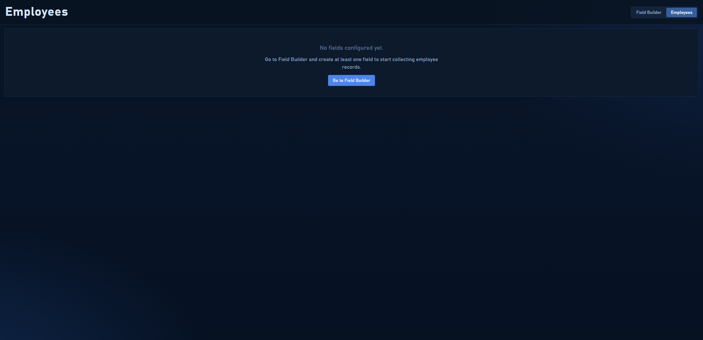
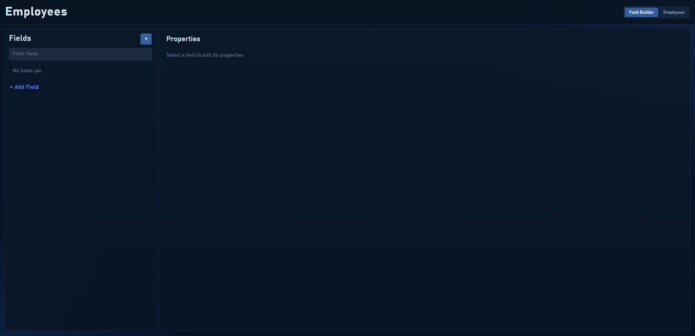
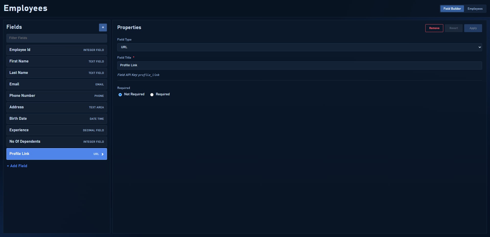
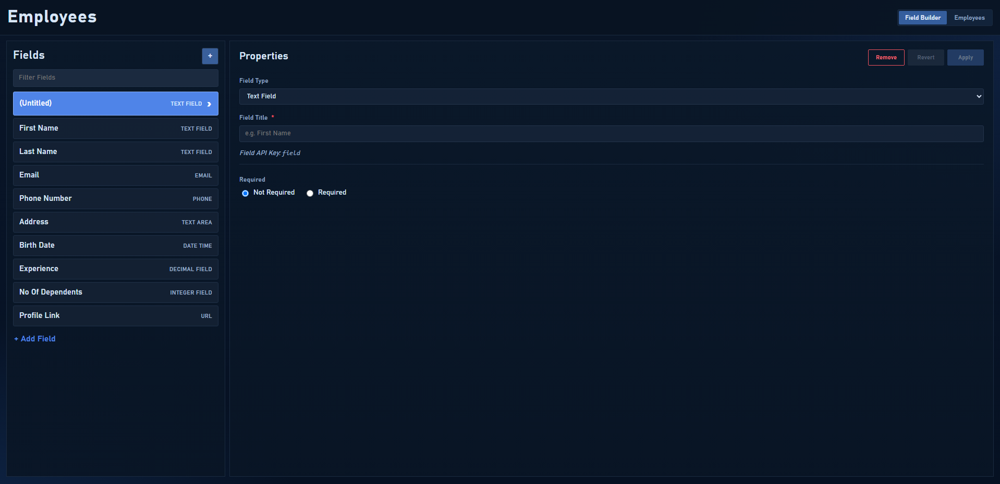
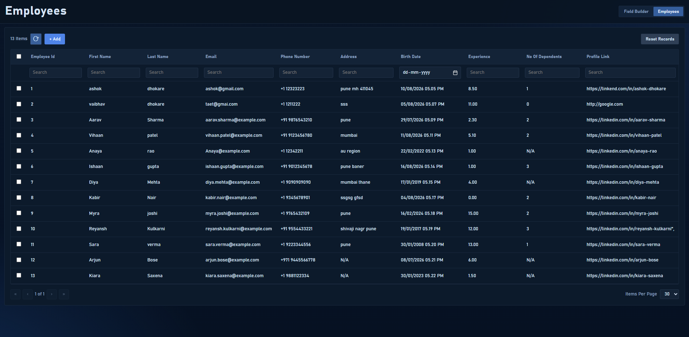
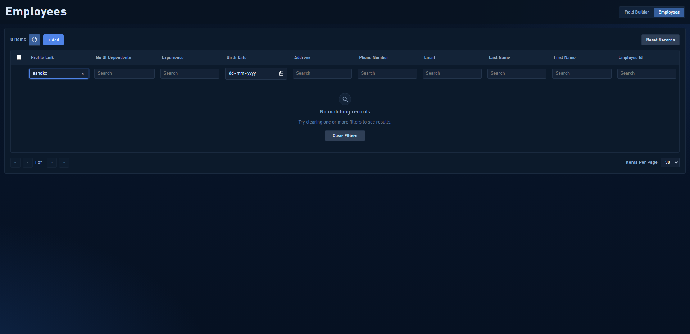
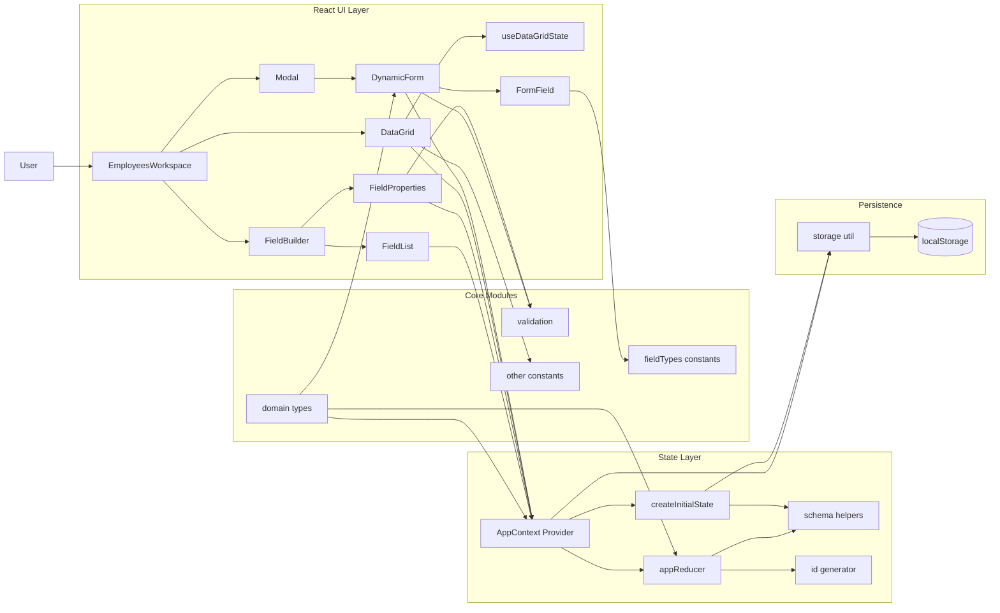

# Dynamic Form Builder

A React application that lets a user define a custom form schema, generate a
data-entry form from that schema, and view submitted records in a searchable,
sortable data grid.

Built for the HackerRank "Dynamic Form Builder" take-home assignment.

## Live Demo

- https://dynamic-form-builder-pi-neon.vercel.app/

## Demo Video

- https://drive.google.com/file/d/1t1RiaEfF7KyqOx0OwM99_v5UJ2PWI47i/view?usp=sharing

## Screenshots

### 1. Employees workspace with no fields configured



### 2. Empty Field Builder state



### 3. Field Builder with populated schema



### 4. New untitled field selected



### 5. Employees grid with records



### 6. No matching records (active filters)



## GitHub Repository

- https://github.com/ASHoKuni/dynamic-form-builder

## Setup Instructions

### Prerequisites

- Node.js 18+
- npm 9+

### Option A: Run from HackerRank ZIP submission

1. Download the ZIP and extract it.
2. Open a terminal in the extracted project folder.
3. Install dependencies and start the app:

```bash
npm install
npm run dev
```

4. Open http://localhost:5173 in your browser.

### Option B: Run from GitHub repository

### 1. Clone the repository

```bash
git clone https://github.com/ASHoKuni/dynamic-form-builder.git
cd dynamic-form-builder
```

### 2. Install dependencies

```bash
npm install
```

### 3. Run the app locally

```bash
npm run dev
```

Open `http://localhost:5173` in your browser.

### 4. Useful commands

```bash
npm run check      # typecheck + lint + unit/component tests + build
npm run test:e2e   # run Playwright end-to-end flow
npm run build      # production build -> dist/
npm run preview    # serve the production build locally
```

### Update an existing local copy

```bash
git pull origin main
npm install
npm run dev
```

No backend or environment variables are required — the app persists data to
the browser's `localStorage`, so it also works after a full page refresh.

## Architecture

```
src/
  constants/
    dataGridConstants.ts   # grid pagination/date formatting constants
    dynamicFormConstants.ts # dynamic form constants (phone country codes)
    fieldTypes.ts       # single source of truth for supported field types
                         # (label, HTML input type) used by the builder,
                         # the generated form, and validation
    storageConstants.ts   # storage key constants
    workspaceConstants.ts # workspace tab constants
  utils/
    storage.ts           # localStorage read/write for schema + records
    validation.ts         # field key generation + per-type validation rules
  types/
    domain.ts            # shared domain models and reducer action types
  state/
    defaultSchema.ts     # starter schema seed used at first load
    id.ts                # id generation strategy (uuid + fallback)
    schema.ts            # schema key helpers and record-key migration
    reducer.ts           # pure reducer for app actions
    initialState.ts      # lazy initial state creation from localStorage
  context/
    AppContext.tsx        # global state: schema, records, selected field
                         # (React Context + useReducer, persisted via
                         # utils/storage on every change)
  components/
    FieldBuilder/
      FieldBuilder.tsx    # layout: FieldList + FieldProperties side by side
      FieldList.tsx       # left panel — list of configured fields, filter,
                          # "+ Add Field"
      FieldProperties.tsx # right panel — Field Type / Title / Required,
                         # with Remove / Revert / Apply (local draft state,
                         # only committed to context on Apply)
    DynamicForm/
      DynamicForm.tsx      # record creation form generated from `schema`
      FormField.tsx        # renders one input, picking the right HTML
                         # input type for the field's configured type
    DataGrid/
      DataGrid.tsx          # record grid: dynamic columns from schema,
                         # per-column search, column sort, pagination,
                         # row selection + delete
      useDataGridState.ts  # extracted grid state logic (filter/sort/page/select)
    common/
      Modal.tsx           # small reusable modal shell (used for
                         # "Create New Employee")
  App.tsx                  # app shell: header, Field Builder / Employees
                         # tabs, wires the "Add" modal to DynamicForm
```

### Architecture Diagram



**State management.** Schema and records live in one `AppContext`
(`useReducer`), so both the Field Builder and the Data Grid always read the
same source of truth. Every dispatch is followed by a `useEffect` that
persists the updated `schema` / `records` array to `localStorage`, so the
"mock API" for this assignment is a small persistence layer rather than a
real backend.

**Dynamic behavior.** Nothing about a field's type is hard-coded outside
`constants/fieldTypes.ts`: adding a new type there (label + HTML input
type) automatically shows up in the Field Type dropdown, the generated
form, and the grid — the form and grid never special-case field types by
name. Validation remains field-type driven, while optional field behavior
metadata (`unique`, `autoIncrement`) is available for business rules.

**Validation.** `utils/validation.ts` derives a stable `key` from the
Field Title (e.g. "First Name" → `first_name`), used both as the record's
storage key and the grid's column key. It also holds the per-type
validation rules (required check, integer/decimal/email/url/phone
patterns) shared between the record form and the record grid's schema.

`DynamicForm` uses explicit field metadata to support behavior like:
- `autoIncrement`: prefill next numeric value from existing records
- `unique`: prevent duplicate values for that field

Legacy compatibility is preserved: existing schemas that contain
`employee_id` are auto-migrated on load to include
`{ autoIncrement: true, unique: true }` behavior metadata.

## Accessibility

Accessibility is implemented at a practical baseline and includes:

- semantic label/input associations in generated form fields
- aria-label for phone country selector
- improved warning/error text contrast in Field Builder panels
- keyboard-compatible modal cancel flow (Esc)

## CI Quality Gates

The project includes GitHub Actions workflow [`.github/workflows/ci.yml`](.github/workflows/ci.yml) that runs on every push and pull request.

CI executes these gates in order:

1. `npm ci`
2. `npm run typecheck`
3. `npm run lint`
4. `npm run test:run`
5. `npm run build`
6. `npm run test:e2e`

This ensures only code that compiles, passes static checks, and passes both unit/component and end-to-end tests can be merged safely.

## Test Strategy

- Unit tests validate pure logic modules (validation, constants, storage).
- Component tests validate interactive behavior in `DynamicForm` and `DataGrid` with controlled context state.
- One end-to-end Playwright flow validates the core business journey:
  open app -> go to Employees -> create employee record -> verify row appears in grid.

The e2e spec is in [`e2e/record-flow.spec.ts`](e2e/record-flow.spec.ts), and Playwright setup is in [`playwright.config.ts`](playwright.config.ts).

## Architecture Decisions (ADR-style)

### ADR-001: Shared Application State via Context + Reducer

- Context: Builder, form generation, and grid all need consistent shared schema and records.
- Decision: Use `AppContext` with a reducer implemented in `src/state/reducer.ts`.
- Why: Typed actions and pure state transitions improve predictability and testability.
- Tradeoff: Fewer ecosystem devtools than Redux-based stores.

### ADR-002: Persistence via localStorage

- Context: The assignment permits local persistence instead of backend APIs.
- Decision: Persist schema and records through `src/utils/storage.ts`.
- Why: Zero backend setup while preserving data across refreshes.
- Tradeoff: No server-side sync, auth, or multi-device consistency.

### ADR-003: Field Type Registry as Single Source of Truth

- Context: Field types drive builder options, form rendering, and validation behavior.
- Decision: Centralize supported types in `src/constants/fieldTypes.ts`.
- Why: Adding a new field type becomes a single-file change.
- Tradeoff: Advanced type-specific UI widgets still need targeted component work.

### ADR-004: Key Migration on Field Title Rename

- Context: Renaming a field title changes generated API key and may orphan record values.
- Decision: Migrate old key values to the new key in reducer state transitions.
- Why: Prevents apparent data loss in grid views after schema edits.
- Tradeoff: Slightly more complexity inside schema update logic.

## Assumptions

- No backend was required by the brief, so records and the schema are
  persisted to `localStorage` rather than a mock REST API — this satisfies
  "Can create a mock API or can use a local storage approach."
- A field's Field Title is required before it can be Applied; a blank
  title has no sensible column header or key.
- The auto-generated Field API Key is a display-only convenience (shown
  under Field Title) rather than a separately editable property, since the
  brief lists Field Type / Field Title / Required as the configurable
  properties.
- Editing a field title after records exist migrates values from the old key
  to the new key to avoid data loss in the grid. If a value already exists
  under the new key, it is preserved.
- "Phone" is implemented as country-code selector + number input,
  validated as international-style number with `+` country code.
- Empty grid cell values are shown as `N/A` for readability.
- Column sorting and pagination were implemented as they were called out
  as optional grid capabilities; sorting is single-column only.
- Row selection + bulk delete on the grid was added as a small extra for
  managing test data, beyond the listed requirements.

## Tech Stack

- React 19 + Vite
- Plain CSS (component-scoped stylesheets, no UI framework)
- No external state or form libraries — state is handled with React
  Context + `useReducer`, and validation is a small hand-written module

